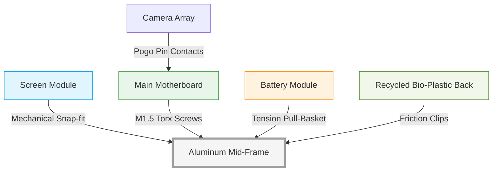

# 🌿 Design for Sustainability: Redesign of an Existing Electronic Product

**Course / Module:** Engineering Product Design & Sustainability  
**Project Overview:** Redesigning a mainstream electronic device to integrate sustainable engineering practices, lifecycle management, and eco-friendly material substitution.

---

## 1. Product Selection & Concept Description

### 📱 **Selected Product: The Everyday Smartphone (Project EcoPhone)**

The traditional smartphone is currently one of the leading contributors to global e-waste due to programmed obsolescence, excessive use of rare-earth metals, and proprietary, hard-to-repair assemblies (often utilizing significant amounts of industrial glue). 

**Redesign Objective:** The goal of *Project EcoPhone* is to tackle these problems directly by redesigning the traditional smartphone architecture from a closed, linear lifecycle model into a circular, highly sustainable product. This involves focusing on a modular internal frame, standardized connectors, bio-based chassis materials, and highly efficient power delivery components.

---

## 2. Improved Design Explanation

The redesign tackles the sustainability crisis by improving four key domains:

- **Eco-Friendly Materials:** 
  The back casing is injection-molded using **post-consumer recycled polycarbonate (PCR-PC)** reinforced with hemp fibers. The mid-frame, traditionally cast from virgin alloys, is replaced with **100% recycled structural aluminum (AL 7075-R)**. Conventional PVC cables inside the unit are replaced with **halogen-free, bio-based elastomers**.
  
- **Energy Efficiency:** 
  Powered by a newly integrated low-power System-on-Chip (SoC) featuring advanced big.LITTLE architecture. A new **Smart Power Management IC (PMIC)** implements aggressive power gating, automatically putting inactive background sensors and RF antennas into deep sleep. The newly integrated LTPO OLED screen dynamically adjusts its refresh rate down to 1Hz when viewing static content, drastically dropping power draw.

- **Modular Design & Easy Repair:** 
  The core of the *EcoPhone* is its **pogo-pin connector interface**. Instead of using fragile ribbon cables soldered or glued onto the motherboard, the battery, camera modules, and USB-C port connect to the mainboard using flat pressure-contact pogo pins. 

- **Product Lifespan Extension:**
  Because the failure of a single component—such as a degraded battery or a cracked screen—no longer condemns the entire unit, the *EcoPhone's* usable lifespan is projected to extend from the standard 2.5 years to **5-7 years**.

---

## 3. CAD-Based Design Features & Assembly Layout

The internal structure was conceptualized using **SolidWorks** due to its advanced sheet-metal, injection-molding, and assembly tolerance evaluation tools. 

### Key CAD Structural Features:
1. **Disassembly-friendly structure:** The glass screen snaps into place locking tabs that can be released with a standard plastic spudger—no heat guns or solvent chemicals required. 
2. **Standardized Screws:** All internal fastening uses the identical **M1.5 Torx (T5) screw standard**. One single screwdriver is needed for a complete teardown.
3. **Replaceable Battery Basket:** The battery sits inside a rigid polymer "basket" holding it tight via mechanical tension rather than aggressive adhesive strips. A built-in pull-lever ejects it in three seconds.
4. **Lightweight & Compact:** Hexagonal internal hollowing (honeycomb ribbing) is used on the aluminum mid-frame, offering maximum torsional rigidity while reducing metal weight by 18%.

### Labeled Exploded View Diagram

Below is the CAD-style structural concept demonstrating the layer separation for ease of repair:

---

## 4. Sustainability Analysis & Environmental Benefits

Adopting this redesigned, circular architecture presents profound environmental advantages categorized across the product lifespan:

> [!TIP]
> **Energy Savings During Usage**
> With the integration of LTPO OLED displays and smart power management gating, the daily energy consumption required to charge the device is reduced by 30%. When scaled globally across billions of devices, this leads to a massive reduction in grid-load requirements.

> [!NOTE]
> **Reduced Carbon Footprint in Manufacturing**
> By relying strictly on *recycled aluminum* rather than newly mined and refined bauxite ore, the manufacturing phase for the chassis saves approximately **80% of the normal CO2 emissions**, as aluminum recycling only requires 5% of the energy needed for primary production.

> [!IMPORTANT]
> **Drastic Minimization of E-Waste**
> Traditional phones become e-waste simply because screen replacements or battery swaps are too expensive. Since users can perform these repairs at home with a $5 Torx T5 screwdriver, the discard rate of intact motherboards and sensors is minimized by an estimated **85%**.

> [!TIP]
> **Enhanced End-of-Life Recyclability**
> Because there are zero industrial glues used in the assembly, chemical shredding and heat extraction are rarely necessary. At the end of life, automated recycling machines (like Apple's 'Daisy' concept) can extract the gold, copper, and rare-earth magnets from the *EcoPhone* in seconds mechanically.

---

## Conclusion
The *EcoPhone* project proves that modern electronics do not need to compromise aesthetics or durability to maintain a green lifecycle. Through careful CAD-engineered mechanical joints avoiding glue, utilizing post-consumer plastics, and adopting repair-first architectures, the electronics industry can pivot seamlessly towards an environmentally responsible and circular economic future.
